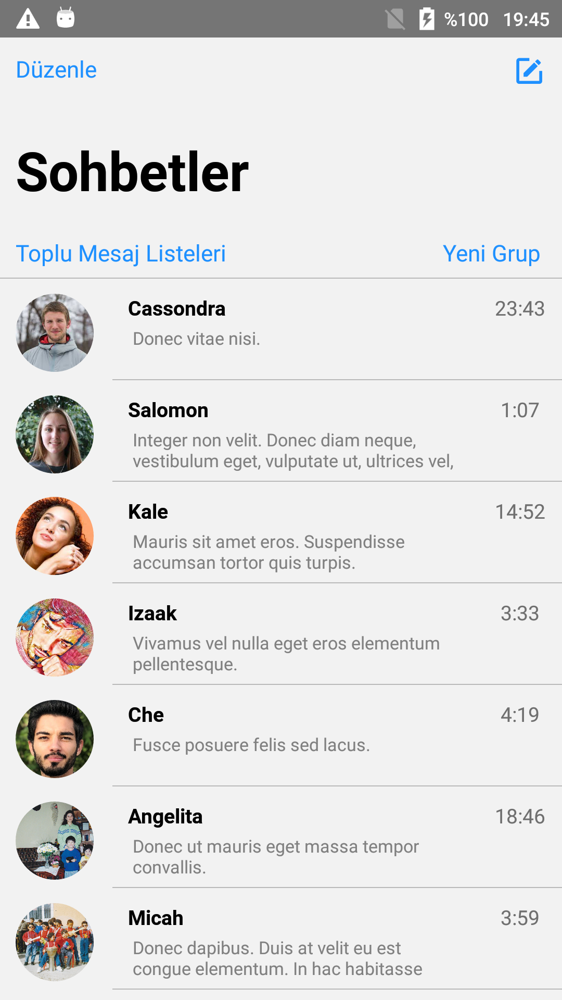
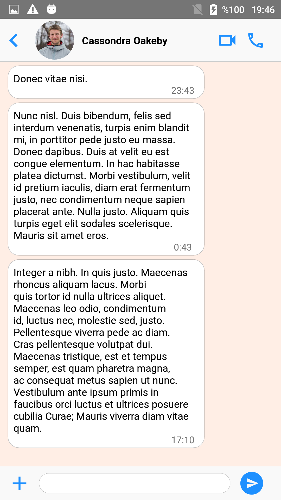
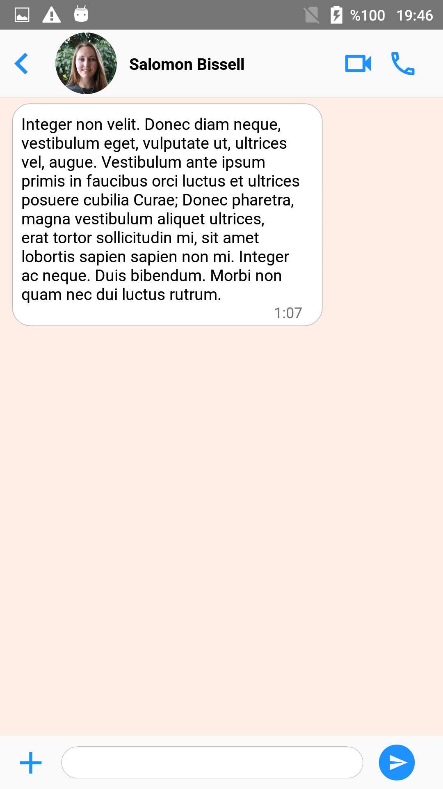
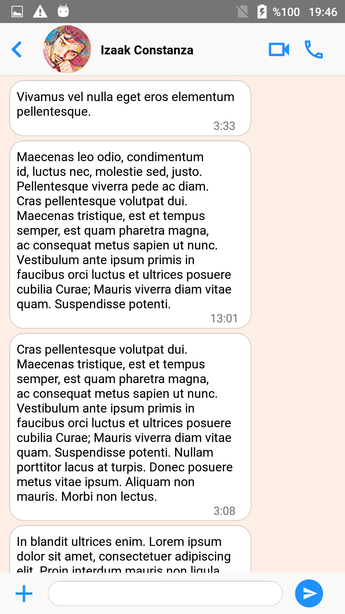

# Homework 2
### This is a simple Whatsapp Mobile Application clone. This project aims to be able to switch between pages click on objects and display the contents on the opened pages.

*This project created with React Native CLI*

## Installation

```
git clone https://github.com/patika-218-akbank-reactnative-bootcamp/assignment-2-akdenizburak.git
```

```
npm install
```

```
npx react-native start & npx react-native run-android
```

# Used Library
* react-native-vector-icons /Octicons/MaterialIcons for Icons
* Stack Navigator
* React navigation for switch between pages
* React navigation passing parameters to routes
* Mockaroo for mock data JSON
* Prefer FlatList using to ScrollView  

## ScreenShots

     
     

## Video
https://user-images.githubusercontent.com/65746583/186988161-ef14af91-d932-4401-ae6c-4bb67811b79a.mp4


##### This is 2.Week Homework at Akbank & Patika.dev React Native Bootcamp's.
